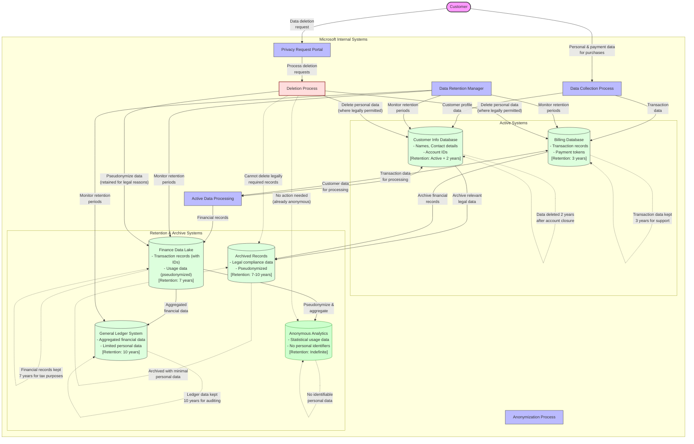

# Commerce Financial Platforms (CFP) - Data Retention & Deletion Flow

This diagram shows the lifecycle, retention, and deletion processes for personal data in Microsoft's Commerce Financial Platforms (CFP).

## Legend

This data retention & deletion flow diagram illustrates:

1. **Data Lifecycle**: Showing how data moves from active systems to archive/anonymized systems
2. **Retention Periods**: Clearly marked retention timeframes for each data store
3. **Deletion Process**: How customer deletion requests are handled across systems
4. **Legal Constraints**: Indicating where data must be retained for legal/tax purposes
5. **Anonymization**: Showing where and how data is anonymized for long-term analytics

## Key Data Protection Elements:

- Clear retention periods defined for all personal data
- Automatic deletion triggers based on retention periods
- Process for handling customer deletion requests
- Pseudonymization and anonymization for data that must be retained
- Separation between active systems and archive/analytical systems
