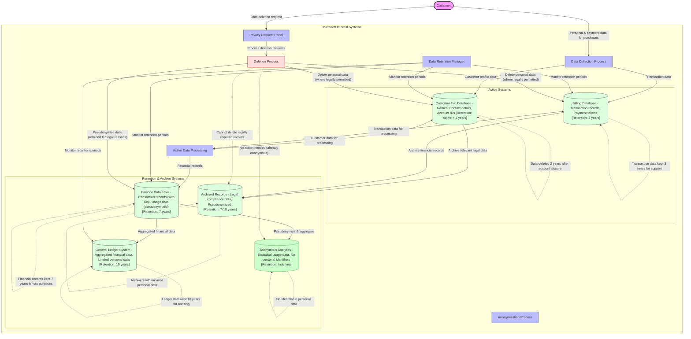
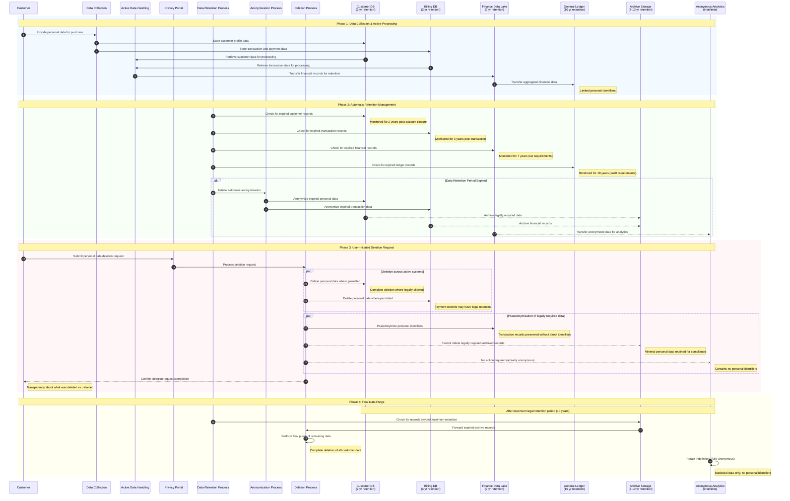

# Commerce Financial Platforms (CFP) - Data Retention & Deletion Flow

This diagram shows the lifecycle, retention, and deletion processes for personal data in Microsoft's Commerce Financial Platforms (CFP).

## Data Lifecycle Sequence

This sequence diagram illustrates the temporal flow of personal data through its complete lifecycle in the Commerce Financial Platforms, from initial collection to eventual deletion or anonymization.

## Legend

This data retention & deletion flow diagram illustrates:

1. **Data Lifecycle**: Showing how data moves from active systems to archive/anonymized systems
2. **Retention Periods**: Clearly marked retention timeframes for each data store
3. **Deletion Process**: How customer deletion requests are handled across systems
4. **Legal Constraints**: Indicating where data must be retained for legal/tax purposes
5. **Anonymization**: Showing where and how data is anonymized for long-term analytics

## Key Data Protection Elements:

- Clear retention periods defined for all personal data
- Automatic deletion triggers based on retention periods
- Process for handling customer deletion requests
- Pseudonymization and anonymization for data that must be retained

## Detailed Retention Policies

The Commerce Financial Platforms implements time-based retention policies:

1. **Active Customer Data**: Retained while account is active plus 2 years
2. **Transaction Records**: Retained for 3 years from transaction date
3. **Financial Records**: Retained for 7 years to meet tax requirements
4. **Ledger Data**: Retained for 10 years to meet accounting/audit requirements
5. **Archived Data**: Contains minimal personal data, maintained for 7-10 years based on legal requirements
6. **Analytics Data**: Fully anonymized with no personal identifiers, retained indefinitely

## Customer Rights Implementation

When a customer exercises their deletion rights:

1. Personal data is immediately deleted from active systems where legally permitted
2. Data with legal retention requirements is pseudonymized to remove direct identifiers
3. Customer receives transparent confirmation of what was deleted vs. retained
4. Remaining pseudonymized data is deleted after legal retention periods expire
- Separation between active systems and archive/analytical systems
