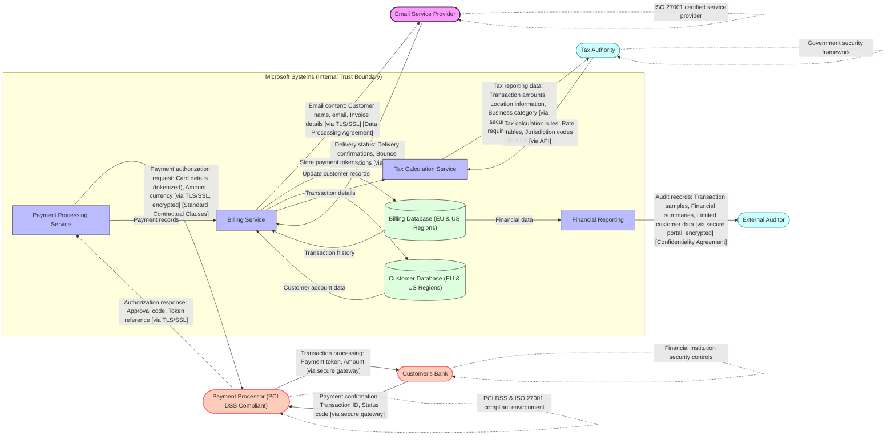
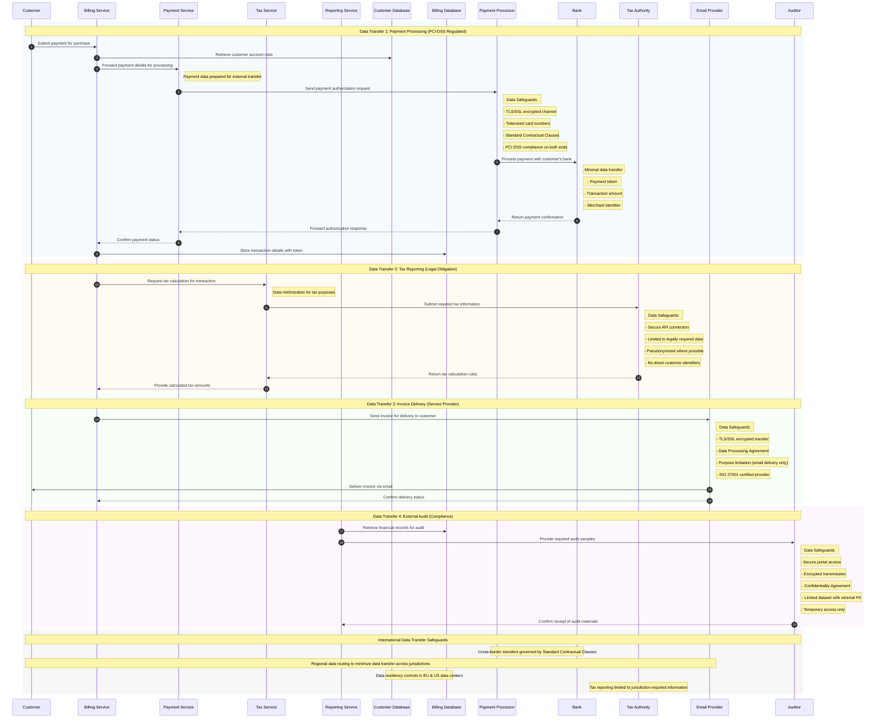

# Commerce Financial Platforms (CFP) - External Data Sharing Flow

This diagram focuses on data transfers across trust boundaries, particularly when personal data leaves Microsoft's Commerce Financial Platforms system and is shared with third parties.

## Cross-Boundary Data Transfer Sequence

This sequence diagram illustrates the chronological flow of personal data across trust boundaries, highlighting the specific security and contractual safeguards in place.

## Legend

This external data sharing flow diagram illustrates:

1. **Trust Boundaries**: Clear delineation between Microsoft systems and external parties
2. **Data Categories**: The specific personal data elements that cross boundaries
3. **Legal Basis**: Identifying flows that occur due to legal/regulatory requirements
4. **Security Measures**: Encryption, secure protocols, and authentication methods
5. **Contractual Safeguards**: References to data protection agreements in place

## Key Data Protection Elements:

- Standard Contractual Clauses (SCCs) govern data transfers to payment processors
- Data Processing Agreements are in place with service providers like email delivery services
- Only necessary data crosses trust boundaries (data minimization principle)
- Sensitive payment data is tokenized before sharing with third parties
- Tax reporting data excludes direct customer identifiers where possible
- All cross-boundary transfers use encryption and secure protocols

## Third-Party Sharing Controls

Microsoft's Commerce Financial Platform implements strict controls for sharing personal data:

1. **Legal Basis**: Each external data transfer has a specific legal basis (contract performance, legal obligation, or legitimate interest)
2. **Purpose Limitation**: Data is shared only for specified, explicit purposes
3. **Contractual Protection**: Formal agreements (SCCs, DPAs) establish recipient obligations
4. **Data Minimization**: Only necessary data elements are shared, with minimized identifiers
5. **Technical Safeguards**: Encryption, secure transfer protocols, and access controls protect data in transit
6. **Compliance Verification**: Third-party security certifications (PCI-DSS, ISO 27001) and audits verify recipient safeguards
