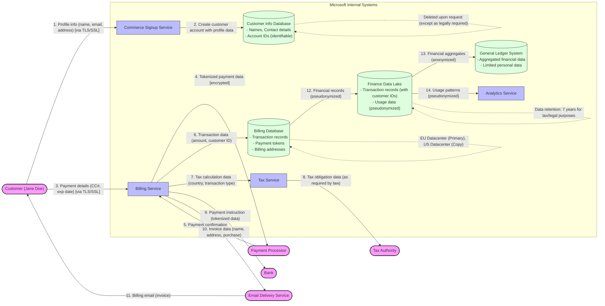

# Commerce Financial Platforms (CFP) - High Level Data Flow Overview

This diagram provides a high-level overview of personal data flows through Microsoft's Commerce Financial Platforms (CFP) system, from collection to deletion.

## Legend

This data flow diagram illustrates:

1. **Data Stores**: Represented as cylinders showing what personal data is stored in each system
2. **Data Flows**: Shown as arrows with labels indicating what personal data moves between components
3. **External Entities**: Shown as rounded rectangles outside Microsoft's boundary
4. **Trust Boundary**: Microsoft's internal systems are enclosed in a subgraph
5. **Flow Sequence**: Numbered from 1-14 showing the progression of data from collection to analytics
6. **Data Protection Notes**: Includes encryption indicators and regional storage information

## Key Data Protection Points:

- Personal payment data is tokenized before leaving Microsoft systems
- All external data transfers use TLS/SSL encryption
- Personal data is pseudonymized when used for analytics
- Regional data storage complies with data sovereignty requirements
- Retention periods are defined based on legal requirements
