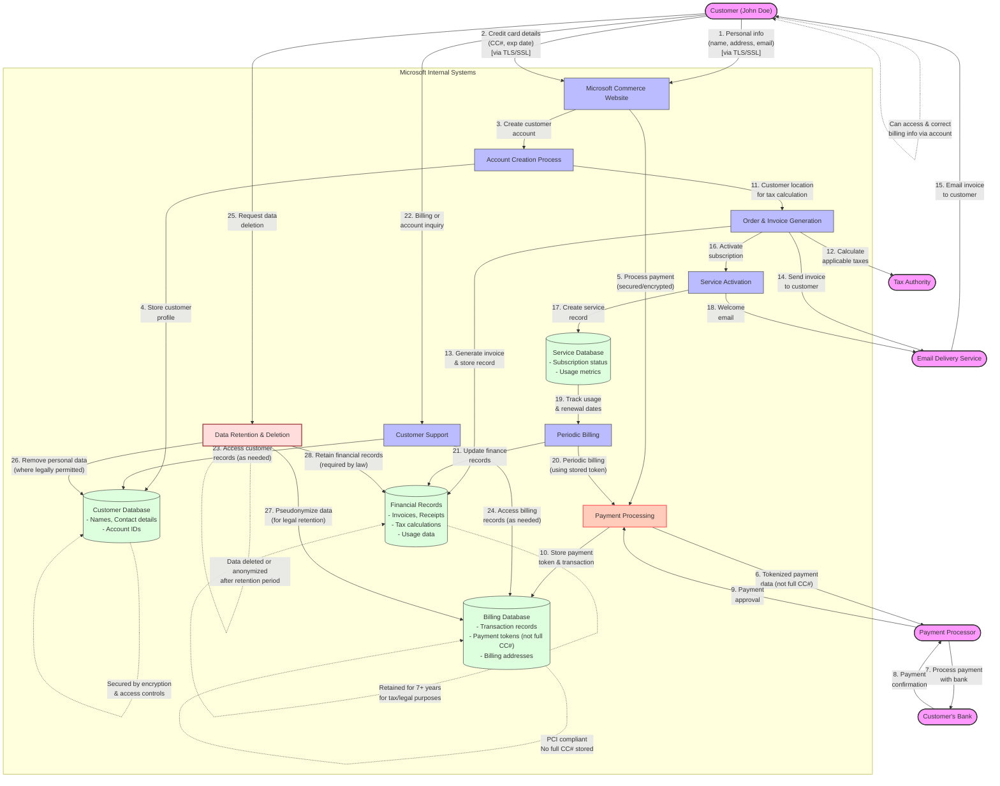

# Commerce Financial Platforms (CFP) - User Journey Perspective

This diagram illustrates the typical user journey and personal data flow from a customer's perspective when purchasing a Microsoft product online.

## Legend

This user journey data flow diagram illustrates:

1. **User Actions**: Key steps the user takes when purchasing and using Microsoft products
2. **Data Collection Points**: Where and how personal data enters Microsoft's systems
3. **Data Processing**: How personal data is processed for legitimate business purposes
4. **Data Storage**: Where personal data is stored and for how long
5. **Data Protection**: Security and privacy measures applied to personal data
6. **Data Sharing**: When and why personal data might be shared with third parties
7. **Data Lifecycle**: How personal data is managed throughout its lifecycle

## Key Data Protection Elements:

- **Security Measures**: All data is transmitted using TLS/SSL encryption
- **Payment Protection**: Full credit card numbers are not stored; tokenization is used instead
- **Access Controls**: Only authorized personnel can access personal data on a need-to-know basis
- **Retention Policies**: Clear retention periods based on legal requirements
- **User Rights**: Customers can access, correct, and request deletion of their data
- **Minimal Sharing**: Personal data is only shared when necessary to complete transactions or comply with legal obligations

## Plain-Language User Journey:

1. **Providing Information**: The customer provides personal details and payment information when making a purchase
2. **Account Creation**: Microsoft creates a billing account for the customer
3. **Payment Processing**: Payment details are securely processed through a payment service
4. **Order Record**: Microsoft generates and stores an order record and invoice
5. **Service Activation**: The purchased service is activated for the customer
6. **Ongoing Service**: Microsoft periodically uses the data for billing and service provision
7. **Customer Support**: If needed, support agents can access relevant customer information
8. **Data Management**: Personal data is protected throughout its lifecycle and eventually deleted or anonymized
