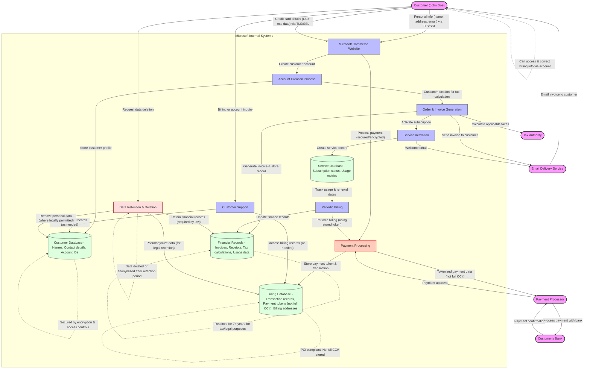
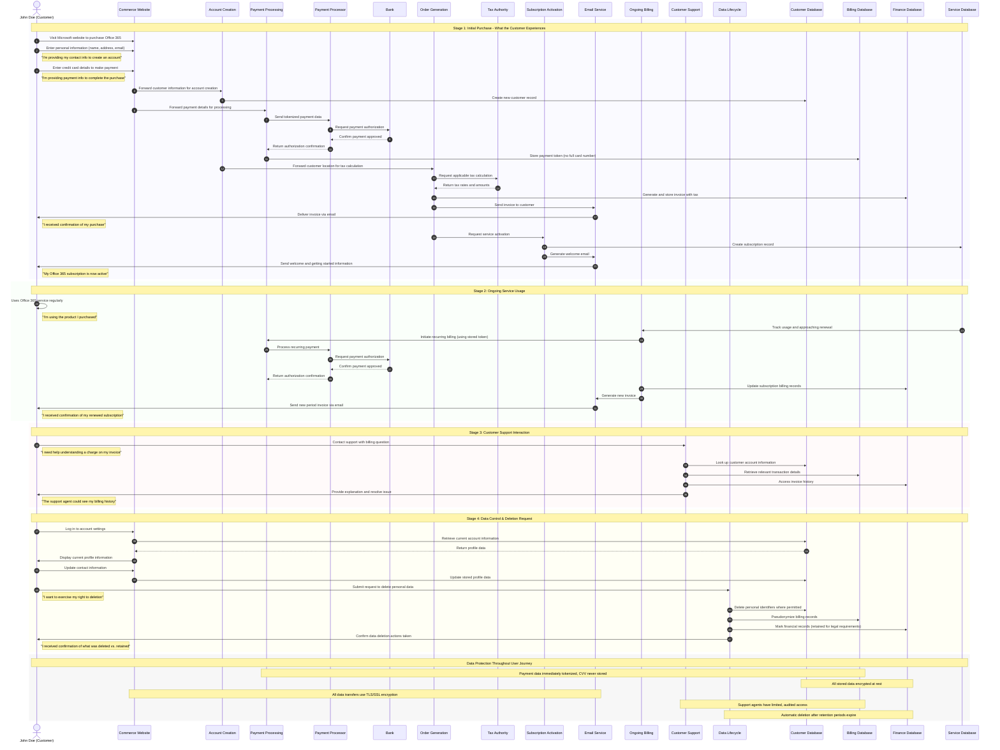

# Commerce Financial Platforms (CFP) - User Journey Perspective

This diagram illustrates the typical user journey and personal data flow from a customer's perspective when purchasing a Microsoft product online.

## User Experience Sequence

This sequence diagram presents the chronological flow of a typical customer's experience when purchasing and using a Microsoft product, highlighting both the visible and behind-the-scenes data processing activities.

## Legend

This user journey data flow diagram illustrates:

1. **User Actions**: Key steps the user takes when purchasing and using Microsoft products
2. **Data Collection Points**: Where and how personal data enters Microsoft's systems
3. **Data Processing**: How personal data is processed for legitimate business purposes
4. **Data Storage**: Where personal data is stored and for how long
5. **Data Protection**: Security and privacy measures applied to personal data
6. **Data Sharing**: When and why personal data might be shared with third parties
7. **Data Lifecycle**: How personal data is managed throughout its lifecycle

## Customer-Centric Processing Details

From the user's perspective, personal data processing in the Commerce Financial Platforms includes:

1. **Account Creation**: Customer provides information to create a profile for purchasing
2. **Payment Processing**: Credit card details are securely processed and tokenized
3. **Tax Calculation**: Address information determines applicable taxes
4. **Service Activation**: Purchase triggers activation of the subscription
5. **Recurring Billing**: Stored payment token used for subscription renewal (no re-entry of card)
6. **Customer Support**: Authorized agents can access necessary account information
7. **User Control**: Customer can view, update, and request deletion of personal information

## Privacy Rights Implementation

The system supports customer privacy rights through:

1. **Transparency**: Clear communication about what data is collected and how it's used
2. **Access**: Customer can view their stored personal information through account settings
3. **Correction**: Self-service options to update contact and billing information
4. **Deletion**: Process to delete personal data with clear explanation of legal retention exceptions
5. **Security**: Multi-layered protection including encryption, access controls, and tokenization
6. **Purpose Limitation**: Data used only for billing, service delivery, and legal requirements

## Key Data Protection Elements:

- **Security Measures**: All data is transmitted using TLS/SSL encryption
- **Payment Protection**: Full credit card numbers are not stored; tokenization is used instead
- **Access Controls**: Only authorized personnel can access personal data on a need-to-know basis
- **Retention Policies**: Clear retention periods based on legal requirements
- **User Rights**: Customers can access, correct, and request deletion of their data
- **Minimal Sharing**: Personal data is only shared when necessary to complete transactions or comply with legal obligations

## Plain-Language User Journey:

1. **Providing Information**: The customer provides personal details and payment information when making a purchase
2. **Account Creation**: Microsoft creates a billing account for the customer
3. **Payment Processing**: Payment details are securely processed through a payment service
4. **Order Record**: Microsoft generates and stores an order record and invoice
5. **Service Activation**: The purchased service is activated for the customer
6. **Ongoing Service**: Microsoft periodically uses the data for billing and service provision
7. **Customer Support**: If needed, support agents can access relevant customer information
8. **Data Management**: Personal data is protected throughout its lifecycle and eventually deleted or anonymized
