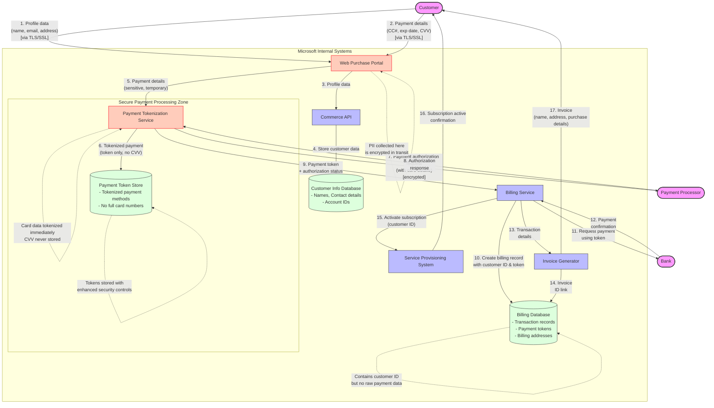

# Commerce Financial Platforms (CFP) - Detailed Transaction Processing

This diagram provides a detailed view of the transaction processing flow in Microsoft's Commerce Financial Platforms (CFP), focusing on how customer payment data is handled.

## Legend

This detailed transaction flow diagram illustrates:

1. **Sensitive Data Handling**: Red-highlighted components handle sensitive payment information
2. **Tokenization**: Credit card details are immediately tokenized and the originals discarded
3. **Secure Processing Zones**: Additional security boundary around payment processing
4. **Data Minimization**: Each system only accesses the personal data it needs
5. **Encryption**: All external transfers are encrypted using TLS/SSL

## Key Data Protection Elements:

- CVV data is never stored and is used only for initial authorization
- Full credit card numbers are replaced with tokens for recurring billing
- Special security controls are applied to systems handling payment data
- Customer data and payment data are stored in separate systems
- Encryption is applied to all data in transit
